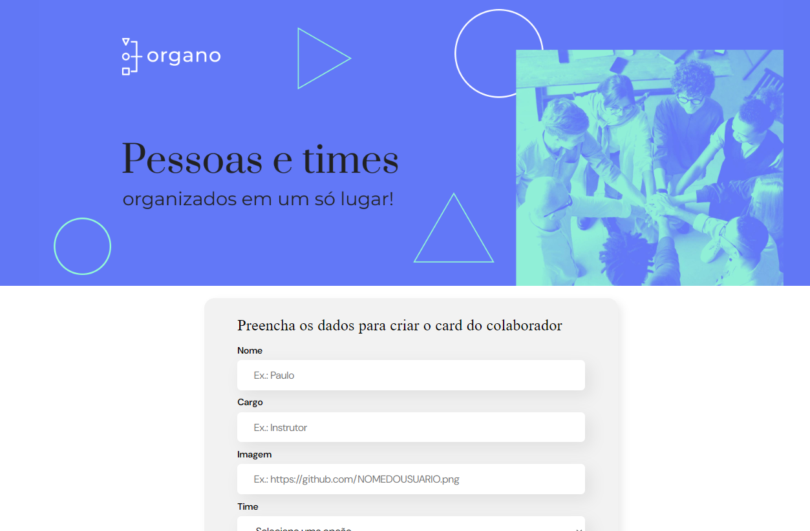

<h1 align="center"> Organo </h1>

<p align="center">
  <a href="#-tecnologias">Technologies</a>&nbsp;&nbsp;&nbsp;|&nbsp;&nbsp;&nbsp;
  <a href="#-projeto">Project</a>&nbsp;&nbsp;&nbsp;|&nbsp;&nbsp;&nbsp;
  <a href="#-layout">Layout</a>&nbsp;&nbsp;&nbsp;|&nbsp;&nbsp;&nbsp;
  <a href="#-learned">What I learned</a>&nbsp;&nbsp;&nbsp;|&nbsp;&nbsp;&nbsp; 
<a href="#memo-licença">License</a>

</p>

<p align="center">
  
</p>

<br>

## 🚀 Technologies

This project was developed with the following technologies:

- HTML e CSS
- JavaScript
- React e JSX
- Vite
- Git e GitHub

## 💻 Project

Organo is an organogram; an organogram is a graphical representation of an organization's structure

## :page_facing_up: What I learned

I learned how to use props in React:

```jsx
export function Team({ name }) {
  return (
    <Container>
      <h3>{name}</h3>
    </Container>
  );
}
```

And how to debug code:

```md
1. Open Dev Tools
2. Add the following command where you want the application pause for manual inspection:

   debugger

3. Run the application
```

## 🔖 Layout

You can access the view through this [link](https://celadon-beignet-7d8bb0.netlify.app).

## :memo: License

This project is licensed under the MIT license

---

Made with ♥ by Chris :wave:
